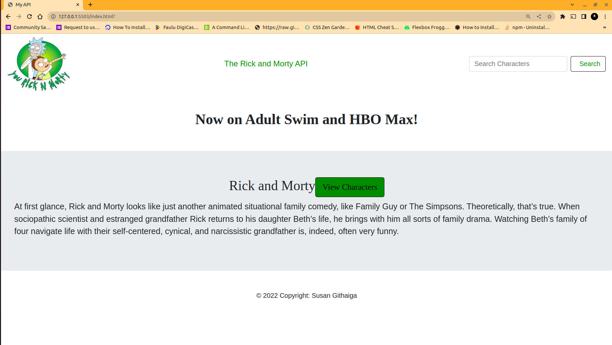

# Phase-1-Independent-Project

# Learning Goals
* Design and architect features across a frontend
* Communicate and collaborate in a technical environment
* Integrate JavaScript and an external API
* Debug issues in small- to medium-sized projects
* Build and iterate on a project MVP


# Project Description.
 This is an application that generates characters from the Rick and Morty show by fetching data from a [public API](https://rickandmortyapi.com/api/character). The user can also search for characters in the show using the search button.


* Link to live site on GitHub: https://github.com/SusanGithaigaN/Phase-1-Independent-Project 


* The following image demonstrates the application functionality:



# Challenges faced.
The main challenge was fnding the right public API to implement onto the project. Most public APIs have a [CORS(Cross-origin resource sharing)](https://developer.mozilla.org/en-US/docs/Web/HTTP/CORS) security feature that restricts HTTP requests that are initiated from scripts running in the browser, thus making it impossible to use some of the APIs.


# How to install and run the project.
To fetch data from our API in this lab, you are required to fetch data from the [Rick and Morty public API](https://rickandmortyapi.com/api/character).

## User story:
```
As I user:
- I can view all Rick& Morty Sitcom characters.
- I can serach for characters on the show.
- I can be able to view how many episodes the characters appeared on.
```

## Research websites used to learn
- Public API list:
https://mixedanalytics.com/blog/list-actually-free-open-no-auth-needed-apis/

- Fetching data from an API:
https://moringa.instructure.com/courses/186/pages/using-fetch?module_item_id=35971

- Searching  data from a public API:


- Javascript events:
https://moringa.instructure.com/courses/186/pages/video-dom-events?module_item_id=35951
https://developer.mozilla.org/en-US/docs/Web/API/Window/DOMContentLoaded_event
https://linuxhint.com/change-button-color-on-click-javascript/
